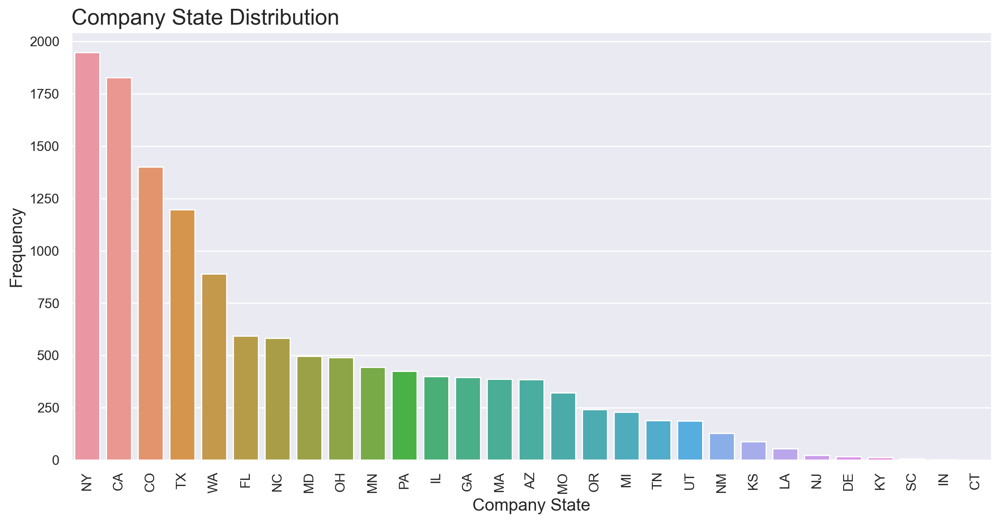
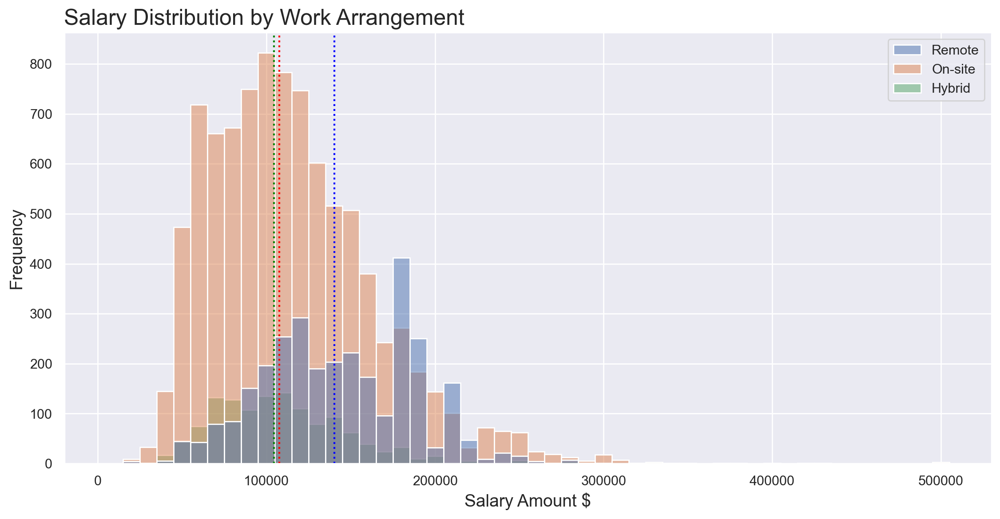

# Web Scraping and Salary Prediction

## Overview

This project was completed as the fourth project of my Data Science Immersive bootcamp at General Assembly in London.  
This document explains the background, the objectives, the methodologies, the conclusions and the tools used.  

  

## Table of Contents

[Background](#Background)  
[Objectives](#Objectives)  
[Data Collection](#Data-Collection)  
[Data Cleaning & Processing](#Data-Cleaning-&-Processing)  
[Exploratory Data Analysis](#Exploratory-Data-Analysis)  
[Modelling](#Modelling)  
[Limitations](#Limitations)  
[Conclusion](#Conclusion)  
[Future Work](#Future-Work)  
[Contact](#Contact)  

  

## Background

Data-related positions are in high demand, and salaries for these positions can vary widely depending on a number of factors, such as the specific job title, the company, the location, and the experience level of the candidate. This can make it difficult for job seekers to know what to expect in terms of salary.  

A model to predict job salaries for data-related positions can be a useful tool for both job seekers and employers. For job seekers, it can help them to set realistic salary expectations and to identify opportunities that are a good match for their skills and experience. For employers, it can help them to benchmark their salaries against the market and to ensure that they are offering competitive salaries to attract and retain top talent.  

  

## Objectives

The goals of this project is to create a classification model which can determine the industry factors that are most important in predicting the salary amounts for data-related positions.

  

## Data Collection

To build a model for predicting high vs low salaries, I utilized web scraping techniques to collect data from the US version of Indeed.com.
The job title, company name, company rating, company location, salary amount and job description were pulled from job listings for a range of American cities and data-related job titles, using a series of functions that I designed to extract relevant information.
Three scrapes were performed: initially a small number of results was retrieved from major US cities, then a tiered approach was implemented to retrieve a different number of results depending on the size of the city's job market, and finally a large number of results was retrieved from the same group of cities.
The raw data retrieved from the last scrape - the most fruitful - consisted of almost 240,000 job listings each containing 8 features.  

  

## Data Cleaning & Processing

After removing duplicates and filtering out entries without monthly or annual salaries, the resulting sample contained approximately 13,400 job listings.  
As part of feature engineering, I created attributes related to the work arrangement (hybrid, remote and on-site) and the number of additional locations; the company location data was inconsistent, so I also extracted the company state and city and used them later for the EDA and modelling stage.  
All work was done in Python on Jupyter notebooks, and the processing revolved around:

* Identifying variables relevant to modelling, and which ones to drop.
* Exploring opportunities for new feature creation.
* Looking for erroneous or missing data.
* Creating the target variable.  

  

## Exploratory Data Analysis
  
  

Initial EDA showed that salary has a typical right skewed distribution with the median equal to $114,500.  
The most common job titles are Senior Data Engineer and Senior Software Engineer, but the majority (~61%) of the job titles in the dataset are unique.  

Leadership positions with the highest median salary (equal to $225,000) are those containing the word head, which are also the rarest, while those related to manager show the lowest median salary (equal to $107,500) which is less than the median salary for all roles.  
The black dotted line represents the median salary for all roles in the main dataset, which is equal to $114,500.  

The cities with the most job listings are New York City, Denver and Austin, and those with the highest median salary are Overland Park (KS), Santa Clara (CA) and Mountain View (CA), which are also the only ones exceeding $150,000.  

The states with the most job listings are New York, California and Colorado, and those with the highest median salary are Delaware, New York, Kansas and California.  

On-site listings are the most frequent in the dataset while hybrid listings are the smallest subset; remote positions have the highest mean and median salary while hybrid ones have the lowest.  

  

## Modelling

I defined the project as a classification problem using the median salary as the splitting point: the baseline accuracy was therefore 0.50, reflecting a perfectly balanced class distribution.  
I defined four sets of models based on different predictors, each with three models to run: Logistic Regression, Decision Tree with GridSearchCV and Random Forest with GridSearchCV.  

The first set of models only used the company state as a factor in predicting whether a job listing had a low salary (defined as below the median salary of all jobs) or a high salary (above the median). Among these models the best were the Logistic Regression and the Decision Tree which achieved a CV score of 0.5693.  

In the second set of models I incorporated additional features, using a set of functions designed to extract information from the job title. The work arrangement was also added on the assumption that, unless explicitly stated, the position was on-site.
Among the three models implemented, the best was the Random Forest which achieved a CV score of 0.7486, a significant improvement compared to previous models that were based only on location.  

Instead of using a limited set of functions to extract information, I enhanced the initial models by implementing NLP (Natural Language Processing) techniques. Specifically, I used CountVectorizer on the third set and TfidfVectorizer on the fourth and final set of models to extract features from the job title.  

In the third set the best model was the Random Forest which achieved a CV score of 0.8318, once again a significant improvement compared to the previous models that used a defined number of features.  
In the last set of models Random Forest achieved a CV score of 0.8386, the highest among all models.  
Both sets observed similar results and performed significantly better than the previous one, and the best model was the Random Forest in the fourth set with a considerable improvement (+0.34) over the baseline of 0.50.  

The best model achieved an accuracy of 84%, a marked improvement from the 50% accuracy of random selection, however this still resulted in incorrect predictions in 16% of cases.  
In this scenario, it would be better to falsely predict that someone will earn less than median when in reality they will earn more, so even if the prediction is wrong, they may be happily surprised to earn more than expected.  
To change our model's predictions so that we do not incorrectly tell someone they will earn more than the median, we had to raise the threshold for predicting a high salary.  
We set the threshold to 85% to reduce the number of false positives, even though this slightly decreased the model's accuracy.  
The model achieved a precision of 96% for high salaries, but it was clearly overpredicting low salaries.  

  

## Limitations

The main limitations of this project arise from the fact that it uses averaged salaries from ranges, which can be quite broad. It would be interesting to compare the performance of the model with precise salaries to see how much of an impact this has.  
Another limitation of the dataset, directly related to Indeed.com, is that it did not include any information about the company size, sector, and revenue.  
Additional work could be aimed at extracting relevant information, especially about the job responsibilities, from the job description using NLP techniques.  

  

## Conclusion

The nature of this project was primarily exploratory, so no hypothesis were made about which factor might have the greatest impact on data-related job salaries.  

The latest Random Forest model using GridSearchCV (which implemented TfidfVectorizer to extract features) achieved an accuracy score of 0.8379 and a CV score of 0.8386.  
The model was balanced between the two classes, had a good accuracy and indeed a very good class separation capacity.  

The most prominent features for this model were the job titles containing engineer, senior and the remote work arrangement, meaning that engineering-related jobs and higher-level positions had the greatest impact in predicting job salaries.  

  

## Future Work

To further improve the current work, the following steps should be taken:
* Feature Engineering, with the creation of additional features such as company sector, company longevity and job responsibilities.
* Using more precise location tags than the company state, possibly by extracting the ZIP code
* Imputing values where missing, to avoid the removal of entire observations.
* Removing outliers, after further analysis and due diligence of the plausible values.
* Employing Gradient Boosting, XGBoost and ensemble methods, checking the effects on the model's performance.  

  

## Contact
Interested in discussing my project further?  
Please feel free to contact me on [LinkedIn](https://www.linkedin.com/in/fedfioravanti/).  

  
